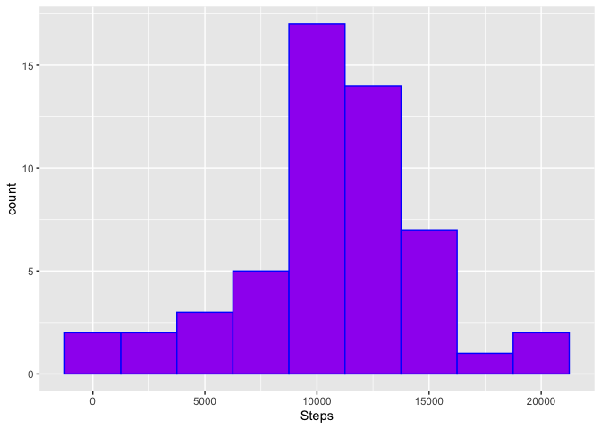
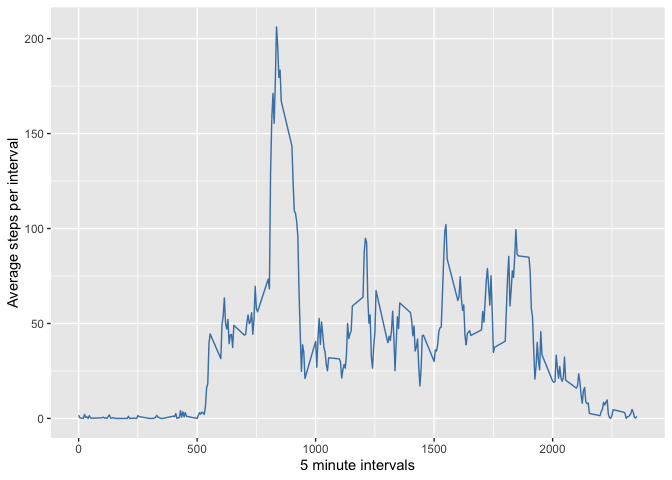
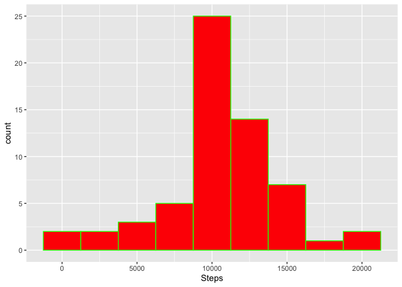
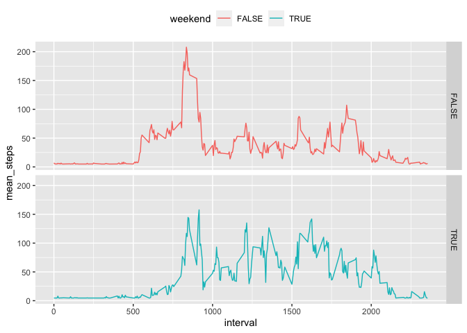

Created on 2020-09-11

## Reproducible research: Week 2 assignment

This R Markdown document explores personal activity monitoring data collected by users of wearables such as Fitbit, Fuelband and Jawbone Up.  

It aims to conduct a number of exploratory analyses, such as evaluating summary statistics and conducting time series analyses, and report these in a reproducible way. 

### Loading and preprocessing the data

The following code downloads the zip file to the working directory and extracts into csv format.


```r
###this will need updated for the repository
setwd("/Users/iainleslie/JH_Datascience/Reproducible_research1")
Od<-read.csv("/Users/iainleslie/JH_Datascience/Reproducible_research1/activity.csv")
head(Od)
```

```
##   steps       date interval
## 1    NA 2012-10-01        0
## 2    NA 2012-10-01        5
## 3    NA 2012-10-01       10
## 4    NA 2012-10-01       15
## 5    NA 2012-10-01       20
## 6    NA 2012-10-01       25
```

### Step 1: What is the mean number of steps perday?

The following code calculates the total number of steps per day


```r
Od_spd <- aggregate(Od$steps,by=list(Category=Od$date),FUN=sum)
Od_spd$Category <- as.Date(Od_spd$Category)
colnames(Od_spd)[2] <- "Steps"
summary(Od_spd)
```

```
##     Category              Steps      
##  Min.   :2012-10-01   Min.   :   41  
##  1st Qu.:2012-10-16   1st Qu.: 8841  
##  Median :2012-10-31   Median :10765  
##  Mean   :2012-10-31   Mean   :10766  
##  3rd Qu.:2012-11-15   3rd Qu.:13294  
##  Max.   :2012-11-30   Max.   :21194  
##                       NA's   :8
```

A histogram of the total steps per diem is shown below:


```r
ggplot(Od_spd,aes(x=Steps)) + geom_histogram(color="blue",fill="purple",binwidth = 2500)
```

```
## Warning: Removed 8 rows containing non-finite values (stat_bin).
```

<!-- -->


```r
mean <- mean(Od_spd$Steps,na.rm = TRUE)
median <- median(Od_spd$Steps,na.rm=TRUE)
```
The mean number of steps per day (after removing null values) is 1.0766189\times 10^{4}.

The median number of steps per day (after removing null values) is 10765.

### Step 2: What the is average daily activity pattern?

A time series plot of average steps taken by 5 minute intervals is shown below:


```r
Od_5mi <- aggregate(Od$steps,by=list(Category=Od$interval),FUN=mean,na.rm=TRUE)
colnames(Od_5mi)[1] <- "Intervals"
colnames(Od_5mi)[2] <- "Steps"
head(Od_5mi)
```

```
##   Intervals     Steps
## 1         0 1.7169811
## 2         5 0.3396226
## 3        10 0.1320755
## 4        15 0.1509434
## 5        20 0.0754717
## 6        25 2.0943396
```

```r
ggplot(Od_5mi,aes(x=Intervals,y=Steps)) + geom_line(color="steelblue") + xlab("5 minute intervals") + ylab("Average steps per interval")
```

<!-- -->

The interval with the highest average number of steps is found as follows:


```r
maxint <- Od_5mi$Intervals[which.max(Od_5mi$Steps)]
```
The interval with the highest number of steps is 835.

### Step 3: Imputing missing values

1. The number of missing values in the dataset is derived below:


```r
Od_NA<-sum(is.na(Od$steps))
Od_NA
```

```
## [1] 2304
```

The original dataset contains 2304 missing values.

2&3. Missing values are imputted with the mean value per day divided by the number of intervals (37.3825996), as it was calculated previously. This is not the most precise method, but doesn't seem to be the focus of the assignment. 
The updated data are saved in a new dataset, nd.

```r
nd <- Od %>%
        mutate(steps = ifelse(is.na(steps),mean/(24*60/5),steps))

head(nd)
```

```
##     steps       date interval
## 1 37.3826 2012-10-01        0
## 2 37.3826 2012-10-01        5
## 3 37.3826 2012-10-01       10
## 4 37.3826 2012-10-01       15
## 5 37.3826 2012-10-01       20
## 6 37.3826 2012-10-01       25
```

4. The below histogram shows the total steps per day


```r
nd_spd <- aggregate(nd$steps,by=list(Category=nd$date),FUN=sum)
nd_spd$Category <- as.Date(nd_spd$Category)
colnames(nd_spd)[2] <- "Steps"
summary(nd_spd)
```

```
##     Category              Steps      
##  Min.   :2012-10-01   Min.   :   41  
##  1st Qu.:2012-10-16   1st Qu.: 9819  
##  Median :2012-10-31   Median :10766  
##  Mean   :2012-10-31   Mean   :10766  
##  3rd Qu.:2012-11-15   3rd Qu.:12811  
##  Max.   :2012-11-30   Max.   :21194
```

```r
ggplot(nd_spd,aes(x=Steps)) + geom_histogram(color="green",fill="red",binwidth = 2500)
```

<!-- -->

```r
mean_new <- mean(nd_spd$Steps,na.rm = TRUE)
median_new <- median(nd_spd$Steps,na.rm=TRUE)
```

The mean and median number of steps per day were 1.0766189\times 10^{4} and 1.0766189\times 10^{4}, respectively. 

The estimates are broadly comparable, as the na.rm function removed missing values in the first version. However, the median and mean are more closely aligned, suggesting the new data are closer to a normal distribution than the original dataset.

### Step 4: How  do weekday and weekend patterns differ?

The following step creates a new column in nd, which states whether the corresponding date was a weekend or weekday:


```r
#Create new variable stating the day of the week
nd$date <- as.Date(nd$date)
nd$weekend = chron::is.weekend(nd$date)
head(nd)
```

```
##     steps       date interval weekend
## 1 37.3826 2012-10-01        0   FALSE
## 2 37.3826 2012-10-01        5   FALSE
## 3 37.3826 2012-10-01       10   FALSE
## 4 37.3826 2012-10-01       15   FALSE
## 5 37.3826 2012-10-01       20   FALSE
## 6 37.3826 2012-10-01       25   FALSE
```

The next steps create two separate time series plots for the average steps at weekends and weekdays.


```r
average_weekdays <- nd %>%
        group_by(weekend,interval) %>% 
                summarise(mean_steps=mean(steps))
head(average_weekdays)
```

```
## # A tibble: 6 x 3
## # Groups:   weekend [1]
##   weekend interval mean_steps
##   <lgl>      <int>      <dbl>
## 1 FALSE          0       7.01
## 2 FALSE          5       5.38
## 3 FALSE         10       5.14
## 4 FALSE         15       5.16
## 5 FALSE         20       5.07
## 6 FALSE         25       6.30
```

```r
ggplot(average_weekdays,aes(x=interval,y=mean_steps,color=weekend)) + geom_line(position="dodge") + theme(legend.position="top") + facet_grid(weekend ~ .)
```

```
## Warning: Width not defined. Set with `position_dodge(width = ?)`
```

<!-- -->

## Conclusions

The information above suggests that people generally start moving earlier in the day on weekdays, but are potentially more average at weekends.


Thank you for peer-reviewing my report, I appreciate it.


### Plagiarism detector
Just a couple of checks in case my code was copied...

Original version of the final report was generated on 11th September 2020. Does this match the date listed below?


```
## [1] "2020-09-11"
```

The original version of the final report was uploaded to git user IDL2013. Does this match the repository for this current version?

If the answers to the above are 'no', please review the original repository and report plagiarism if it is likely.
